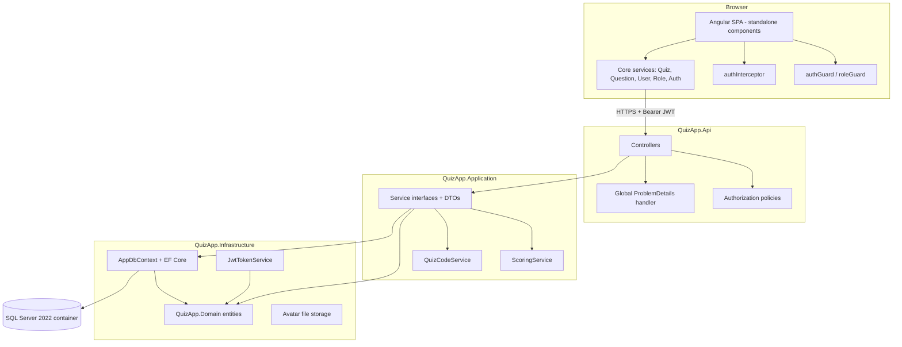

# Requirements

### Overview & Goals

Build a complete **Quiz Application** from the three source documents currently in the repository root:

 Document | Role in this project |
 --- | --- |
 `AnhLV48_SRS_Quiz.docx` | Product truth: actors, UC-01…UC-12, ERD (User, Role, Quiz, Question, Answer, QuizAttempt, UserAnswer), business flows |
 `ANG.P.L001.Opt1.docx` | Engineering truth for the frontend: 5 tasks, exact routes, exact service interfaces (`IQuizService`, `IQuestionService`, `IUserService`, `IRoleService`, `IAuthService`) and ViewModel shapes, screen designs, bonus list |
 `ANG.M.A001.Opt1.docx` | Canonical domain shape: `Quiz` / `Question` / `Answer` and the `QuestionType` enum (`MultipleChoice`, `SingleChoice`, `TrueFalse`, `FillInTheBlanks`, `ShortAnswer`, `LongAnswer`) |

The repository is currently **empty of code** — only the four `.docx` files exist. Everything below is greenfield.

The deliverable is a runnable full-stack system:

- **ASP.NET Core Web API** (`net10.0`, layered 4-project solution, ASP.NET Core Identity + JWT, EF Core → SQL Server in Docker)
- **Angular SPA** (standalone components, lazy routes, functional guards/interceptors)
- **`docker compose`** bringing up database + API + frontend together

### Scope

#### In Scope

**Public / customer experience (UC-01 → UC-06)**
- Home page with active quizzes, About page, Contact page with feedback form
- Quiz list and quiz detail
- Prepare-quiz → take-quiz → submit → **result with score**
- Quiz attempt history, and drill-down into a past attempt

**Authentication (UC-07 → UC-09)**
- Register, log in (JWT), log out, profile dropdown after login
- Route guards: unauthenticated users are redirected to login; non-admin users hitting `/manager/**` land on **403**

**Management (UC-10 → UC-12)**
- Quiz CRUD + assigning/removing questions from a quiz + publish rules
- Question bank CRUD + answer CRUD per question (all six question types)
- User CRUD, activate/deactivate, role assignment
- Role CRUD (`name`, `description`, `isActive`)

**Bonus features (all requested)**
- Score displayed after submitting
- Server-side **paging, searching, sorting** on every management list
- User profile page, **change password**, **avatar upload**
- **Bulk quiz-code generation** for a list of users
- Permission/role assignment to users

#### Out of Scope

- The `ANG.M.A001.Opt1` standalone TypeScript console exercise (its data model is instead absorbed into the backend domain)
- Filling in the empty sections 3/4/5 of `AnhLV48_SRS_Quiz.docx`
- SSR/SSG for Home and About — explicitly marked *Optional* in the handout; the app ships as CSR. Noted as a clean follow-up because JWT-in-`localStorage` needs rework under SSR.
- Real email sending for the Contact form (stored + logged, no SMTP)
- Cloud deployment; `docker compose` on localhost is the deployment target

### User Stories

- As a **visitor**, I want to browse active quizzes on the home page so I can see what is available without an account.
- As a **visitor**, I want to register and log in so I can take quizzes.
- As a **user**, I want to start a quiz either by clicking *Start* or by entering a quiz code so I can begin an attempt.
- As a **user**, I want to answer questions with a visible countdown and submit so I get my score immediately.
- As a **user**, I want to review my past attempts with questions, my answers and what was correct, so I can learn.
- As a **user**, I want to update my profile, avatar and password so my account stays current.
- As an **administrator**, I want to manage quizzes, the question bank and answers so quiz content stays accurate.
- As an **administrator**, I want to page, search and sort management lists so they stay usable with realistic data volumes.
- As an **administrator**, I want to manage users, their status and their roles so access stays controlled.
- As an **administrator**, I want to generate quiz codes in bulk for a list of users so I can run a session for a whole class.

### Functional Requirements (acceptance criteria)

**FR-1 Home & public content**
- Home lists only quizzes where `isActive = true`; each card shows title, description, duration via `DurationFormatPipe`, and a *Start* button.
- Footer year renders through `DatePipe` (`yyyy`); dates elsewhere render as `dd MMMM yyyy` → `16 May 2024`.
- `DurationFormatPipe`: `15 → 15m`, `60 → 1h`, `75 → 1h15m`.
- If the quiz request fails, an error message is shown and the user stays on the page (UC-01 alt-flow 3.1).

**FR-2 Quiz list & detail**
- `/quizzes` lists available quizzes and offers a *quiz code* input.
- An empty list renders an explicit empty state, not a blank page (UC-02 alt-flow 3.2).
- Unknown quiz id → friendly "not found" message with a link back to the list (UC-03 alt-flow 3.1).

**FR-3 Take a quiz**
- Requires authentication; anonymous users are redirected to login and returned to the quiz afterwards (UC-05 precondition, UC-08 alt-flow 1.1).
- *Prepare* screen shows quiz title, description, thumbnail, duration and the identified user before the attempt starts.
- Starting an attempt records `startTime` **server-side**; the deadline is `startTime + duration` and is enforced by the API, not by the browser clock.
- The take-quiz payload **never contains `isCorrect`** — answers are returned as `{ id, content }` only.
- Submitting with unanswered questions raises a confirmation prompt listing the count (UC-05 alt-flow 4.1); *Cancel* asks for confirmation and abandons the attempt without submitting (alt-flow 5.1).
- Score is computed server-side and returned with the result.
- A submitted attempt cannot be submitted again.

**FR-4 Quiz history**
- `/quizzes/history` lists the current user's attempts with quiz title, submitted time and score.
- Selecting an attempt shows each question, the answer the user picked and the correct answer.
- No attempts → explicit "no quiz history" message (UC-06 alt-flow 2.1).

**FR-5 Authentication**
- Register captures first name, last name, email, username, phone, date of birth, password, confirm password; client-side and server-side validation both apply.
- Login returns `{ userInformation, token, expires }`; the token is attached to subsequent API calls by an interceptor.
- Duplicate username/email and wrong credentials produce a dialog message, never a stack trace.
- A user with `isActive = false` cannot log in.
- Logout clears client auth state and returns to Home; it also works when the token has already expired (UC-09 alt-flow 4.1).

**FR-6 Management**
- Every `/manager/**` route requires an authenticated user in role `Admin` or `Editor`; anyone else gets `/403`.
- Quiz edit shows a *Show Questions* panel; the Add form does not (handout Task 5).
- Question edit shows a *Show Answers* panel; the Add form does not.
- A quiz cannot be activated/published while it has zero questions — the reason is shown and the quiz stays draft (UC-10 alt-flow 9.1).
- Deleting a question warns when it is assigned to quizzes, then removes it from those quizzes on confirm (UC-11 alt-flow 3.1).
- The user Add/Edit form never edits an existing password; a separate *Change password* flow exists.
- Every management list supports paging, keyword search and column sorting, evaluated on the server.

**FR-7 Quiz codes**
- A code binds `(quiz, user)` and carries `isUsed` and an expiry.
- *Start* on a quiz card self-issues a code for the current user; the code input on `/quizzes` consumes an existing one.
- Admins can bulk-generate codes for a selected quiz and a selected set of users, then export the result as CSV.
- Invalid, already-used, expired or foreign-user codes are rejected with a clear message.

### Non-Functional Requirements

- **Security** — passwords hashed by ASP.NET Core Identity; JWT signing key, issuer, audience and lifetime read from configuration/environment, never hardcoded; CORS restricted to the configured frontend origin; correct-answer data never leaves the server during an attempt; role checks enforced by API authorization policies as well as by Angular guards.
- **Validation** — request DTOs validated at the API boundary; failures return RFC 7807 `ProblemDetails` with field-level errors that the Angular forms display inline.
- **Error handling** — a global exception handler maps domain errors to `400/403/404/409` and unexpected errors to `500` with a correlation id; internal details are logged, never returned.
- **Performance** — management lists are paged and sorted in SQL (no client-side paging over full tables); quiz loading uses projections and split queries to avoid N+1 across Quiz → Question → Answer.
- **Configurability** — connection string, JWT settings, CORS origins, default page size, quiz-code length and expiry are all configuration values.
- **Reproducibility** — `docker compose up` starts SQL Server, API and frontend; migrations and seed data apply automatically on API start-up in Development.

# Technical Design

### Current Implementation

There is none. `D:\Homeworks\mock_project` contains only `ANG.M.A001.Opt1.docx`, `ANG.P.L001.Opt1.docx`, `AnhLV48_SRS_Quiz.docx` and `Template1_SRS-Document.docx`. The `.docx` files stay where they are and act as the specification.

Verified toolchain on this machine:

- .NET SDK **10.0.303** → target `net10.0`
- Node **24.18.0**, npm **11.16.0**; Angular CLI latest is **22.1.6** (invoked via `npx`, no global install)
- Docker **29.7.2** + Compose **v5.4.0** → SQL Server 2022 container is viable
- No LocalDB and no global `dotnet-ef` → EF tooling is pinned as a **local tool manifest** (`.config/dotnet-tools.json`) so migrations are reproducible

### Key Decisions

 # | Decision | Rationale |
 --- | --- | --- |
 D1 | **Layered 4-project backend**: `Domain` → `Application` → `Infrastructure` → `Api` | Scoring and quiz-code rules are the interesting logic; keeping them out of EF Core and out of controllers makes them unit-testable without a database. |
 D2 | **ASP.NET Core Identity** with `ApplicationUser : IdentityUser<Guid>` / `ApplicationRole : IdentityRole<Guid>`, JWT issued manually | Free, audited password hashing, lockout and uniqueness rules; the extra SRS fields are added by extending the Identity classes rather than replacing them. |
 D3 | **Angular standalone + lazy routes**, functional guards/interceptors, signals for auth state | Current Angular default; the handout's `RouterModule`/`FormsModule` wording is honoured semantically via `provideRouter` and `ReactiveFormsModule` imports. |
 D4 | **`Guid` primary keys** | The handout's Angular contracts all use `id: string`; `Guid` serialises to `string` with no mapping layer and avoids leaking sequential ids. |
 D5 | **Scoring is server-only** | The take-quiz payload omits `isCorrect`, the deadline is derived from a server-recorded `startTime`, and submission is idempotent — otherwise the quiz is trivially cheatable from devtools. |
 D6 | **Quiz codes are first-class entities** | The handout's `prepareQuiz`/`takeQuiz`/`submitQuiz` all carry a `quizCode`, and the bonus asks for bulk generation; modelling it as an entity satisfies both plus the *Start button* path (self-issued code). |
 D7 | **List endpoints always return `PagedResult<T>`**; the Angular service exposes both `getAll()` (maps `.items`) and `getPaged(query)` | Keeps the handout's `getAll(): Observable<T[]>` signature intact while enabling the paging/search/sort bonus without a second parallel endpoint family. |
 D8 | **Secrets and endpoints come from configuration** | SA password, JWT key and API base URL live in `.env` / `appsettings` / Angular `environments`; a committed `.env.example` documents them. |

### Proposed Changes

#### Domain model (`QuizApp.Domain`)

Entities derived from the SRS ERD, extended with the fields the handout's ViewModels require:

- `ApplicationUser : IdentityUser<Guid>` → `FirstName`, `LastName`, `DateOfBirth`, `AvatarUrl`, `IsActive`; `DisplayName` computed
- `ApplicationRole : IdentityRole<Guid>` → `Description`, `IsActive`
- `Quiz` → `Title`, `Description`, `Duration` (minutes), `ThumbnailUrl`, `IsActive`, audit fields
- `Question` → `Content`, `QuestionType`, `IsActive`
- `Answer` → `Content`, `IsCorrect`, `IsActive`, `QuestionId`
- `QuizQuestion` → join table `QuizId` + `QuestionId` + `DisplayOrder` (a question in the bank can serve many quizzes)
- `QuizCode` → `Code`, `QuizId`, `UserId`, `IsUsed`, `ExpiresAt`
- `QuizAttempt` → `QuizId`, `UserId`, `QuizCode`, `StartTime`, `SubmittedAt`, `Status`, `Score`, `CorrectCount`, `TotalQuestions`
- `UserAnswer` → `QuizAttemptId`, `QuestionId`, `AnswerId?`, `TextAnswer?`, `IsCorrect`
- `Feedback` → Contact-form submissions

`QuestionType` enum is taken verbatim from `ANG.M.A001.Opt1`.

#### Application layer (`QuizApp.Application`)

Service interfaces mirroring the Angular contracts one-for-one, so the two sides stay in lockstep: `IQuizService`, `IQuestionService`, `IAnswerService`, `IUserService`, `IRoleService`, `IAuthService`, `IQuizAttemptService`, `IQuizCodeService`. Plus:

- `IScoringService` — the only place that knows how each `QuestionType` is graded
- `PagedQuery` / `PagedResult<T>` — shared paging/search/sort contract
- DTOs named exactly as in the handout (`QuizViewModel`, `QuizCreateViewModel`, `QuizForTestViewModel`, …)
- FluentValidation validators per command DTO

**Scoring rules** (`ScoringService`):

 Question type | Grading |
 --- | --- |
 `SingleChoice`, `TrueFalse` | Selected answer must be the correct one |
 `MultipleChoice` | All-or-nothing: selected set must equal the correct set |
 `FillInTheBlanks`, `ShortAnswer` | Trimmed, case-insensitive match against any correct answer text |
 `LongAnswer` | Not auto-graded — stored, excluded from the denominator, flagged for manual review |

`Score = round(correctCount / gradableQuestionCount * 100)`.

#### Infrastructure (`QuizApp.Infrastructure`)

`AppDbContext : IdentityDbContext<ApplicationUser, ApplicationRole, Guid>`, `IEntityTypeConfiguration<>` per entity, EF Core migrations, a `DbSeeder` (roles `Admin`/`Editor`/`User`, an admin account from configuration, sample quizzes/questions/answers so the UI is never empty), `JwtTokenService`, and a local-disk `IFileStorage` for avatars.

#### API (`QuizApp.Api`)

Thin controllers, JWT bearer + authorization policies (`RequireManager` = `Admin` or `Editor`), CORS from config, Swagger with a bearer security definition, and a global exception handler producing `ProblemDetails`.

#### Frontend (`frontend/quiz-app`)

`core/` holds models, service interfaces + `InjectionToken`s + HTTP implementations, functional `authGuard`/`roleGuard`, `authInterceptor` (attaches bearer, redirects on 401) and `errorInterceptor` (maps `ProblemDetails` to toast/dialog). `shared/` holds `HeaderComponent`, `FooterComponent`, `QuizCardComponent`, `SidebarComponent`, `PaginationComponent`, `ConfirmDialogComponent` and `DurationFormatPipe`. `layouts/` holds the three layouts the handout requires. `features/` holds the pages, lazy-loaded per area.

Routes match the handout exactly: `/`, `/about`, `/contact`, `/quizzes`, `/auth/login`, `/auth/register`, `/manager/quiz`, `/manager/question`, `/manager/user`, `/manager/role`, plus `/quizzes/:id`, `/quizzes/:id/prepare`, `/quizzes/:id/take`, `/quizzes/attempts`, `/profile`, `/403`, `/**` → 404.

### Architecture Diagram



### File Structure

```
D:\Homeworks\mock_project\
├─ ANG.M.A001.Opt1.docx            (unchanged - spec)
├─ ANG.P.L001.Opt1.docx            (unchanged - spec)
├─ AnhLV48_SRS_Quiz.docx           (unchanged - spec)
├─ Template1_SRS-Document.docx     (unchanged - spec)
├─ docker-compose.yml
├─ .env.example
├─ README.md
├─ backend/
│  ├─ QuizApp.sln
│  ├─ .config/dotnet-tools.json
│  ├─ src/
│  │  ├─ QuizApp.Domain/          Entities/, Enums/, Common/
│  │  ├─ QuizApp.Application/     Interfaces/, DTOs/, Services/, Validators/, Common/Paging
│  │  ├─ QuizApp.Infrastructure/  Persistence/ (AppDbContext, Configurations, Migrations, DbSeeder),
│  │  │                           Identity/ (JwtTokenService), Storage/
│  │  └─ QuizApp.Api/             Controllers/, Middleware/, Program.cs, appsettings*.json, Dockerfile
│  └─ tests/
│     ├─ QuizApp.Application.Tests/
│     └─ QuizApp.Api.IntegrationTests/
└─ frontend/quiz-app/
   ├─ src/app/core/{models,services,guards,interceptors}
   ├─ src/app/shared/{components,pipes}
   ├─ src/app/layouts/{authentication,customer,manager}
   ├─ src/app/features/{home,about,contact,quizzes,auth,profile,manager,errors}
   ├─ src/environments/
   ├─ Dockerfile + nginx.conf
   └─ angular.json, package.json
```

### Risks

**Contradictions in the source documents, and how they are resolved**

 Issue | Resolution |
 --- | --- |
 `ANG.P.L001` types `QuizForTestViewModel.question` as `UserViewModel` | Clear typo — implemented as `questions: QuestionForTestViewModel[]`, as the surrounding text states. |
 `getAnswersByQuestionId(id): Observable<AnswerViewModel>` (singular) | Implemented as `Observable<AnswerViewModel[]>`; the singular return is inconsistent with the method name and with `getAnswerById`. |
 `UserAnswerSubmissionViewModel` carries a single `answerId`, but `MultipleChoice` allows several correct answers, and `FillInTheBlanks`/`ShortAnswer` need free text | Extended to `{ questionId, answerId?, answerIds?, textAnswer? }`, keeping `answerId` working for the single-choice case so the documented shape still validates. |
 SRS says a quiz starts from *Start*; the handout requires a `quizCode` everywhere | *Start* self-issues a code bound to `(user, quiz)`; the `/quizzes` code box consumes a pre-issued one. Both converge on the same prepare screen. |
 `IRoleService` needs `description` + `isActive`, absent from `IdentityRole` | `ApplicationRole` extends `IdentityRole<Guid>` with both fields. |
 The handout mentions an `about` page with "our team using fake data" | Kept as static content — it is presentational, not a data feature. |

**Technical risks**

- *JWT in `localStorage`* is XSS-exposed. Mitigated by short token lifetime, Angular's default sanitisation, no `bypassSecurityTrust*`, and no rendering of user HTML. A refresh-token/HttpOnly-cookie upgrade is noted as follow-up.
- *Cascade deletes* between Quiz → QuizQuestion and Question → Answer must be explicit; attempt history must survive quiz deletion, so `QuizAttempt` uses `Restrict` and quizzes are soft-deactivated rather than hard-deleted when attempts exist.
- *SQL Server container start-up* is slower than the API's. The API retries the connection on start-up and Compose uses a healthcheck so migrations do not run against a not-yet-ready server.
- *Angular 22 + Node 24* is a very new combination; if the CLI misbehaves the plan falls back to the Angular 21 LTS line, which is equally compatible with the handout's requirements.

# API & Contracts

### ViewModels

Names and fields are taken verbatim from `ANG.P.L001.Opt1.docx` so the Angular services in the handout compile unchanged, with the corrections listed under *Risks*.

```ts
// ---- Quiz
interface QuizViewModel        { id: string; title: string; description: string; duration: number; isActive: boolean; thumbnailUrl?: string; }
interface QuizCreateViewModel  { title: string; description: string; duration: number; isActive: boolean; }
interface QuizEditViewModel    { id: string; title: string; description: string; duration: number; isActive: boolean; }
interface QuizQuestionCreateViewModel { quizId: string; questionId: string; }

// ---- Taking a quiz
interface PrepareQuizViewModel      { userId: string; quizId: string; quizCode: string; }
interface QuizPrepareInfoViewModel  { id: string; title: string; description: string; duration: number;
                                      thumbnailUrl: string; quizCode: string; user: UserViewModel; }
interface TakeQuizViewModel         { userId: string; quizId: string; quizCode: string; }
interface QuizForTestViewModel      { id: string; title: string; description: string; duration: number;
                                      quizCode: string; startTime: string; endTime: string;
                                      questions: QuestionForTestViewModel[]; }
interface QuestionForTestViewModel  { id: string; content: string; questionType: QuestionType;
                                      answers: AnswerForTestViewModel[]; }
interface AnswerForTestViewModel    { id: string; content: string; }   // deliberately no isCorrect
interface UserAnswerSubmissionViewModel { questionId: string; answerId?: string; answerIds?: string[]; textAnswer?: string; }
interface QuizSubmissionViewModel   { quizId: string; userId: string; quizCode: string;
                                      answers: UserAnswerSubmissionViewModel[]; }
interface QuizResultViewModel       { attemptId: string; quizTitle: string; score: number;
                                      correctCount: number; totalQuestions: number; submittedAt: string; }

// ---- Question bank
interface QuestionViewModel        { id: string; content: string; questionType: QuestionType; isActive: boolean; }
interface QuestionCreateViewModel  { content: string; questionType: QuestionType; isActive: boolean; }
interface QuestionEditViewModel    { id: string; content: string; questionType: QuestionType; isActive: boolean; }
interface AnswerViewModel          { id: string; content: string; isCorrect: boolean; isActive: boolean; questionId: string; }
interface AnswerCreateViewModel    { content: string; isCorrect: boolean; isActive: boolean; questionId: string; }
interface AnswerEditViewModel      { id: string; content: string; isCorrect: boolean; isActive: boolean; questionId: string; }

// ---- Users & roles
interface UserViewModel        { id: string; firstName: string; lastName: string; displayName: string; email: string;
                                 userName: string; phoneNumber: string; dateOfBirth: string; avatar: string;
                                 isActive: boolean; roles: string[]; }
interface UserCreateViewModel  { firstName: string; lastName: string; email: string; userName: string; phoneNumber: string;
                                 dateOfBirth: string; password: string; confirmPassword: string; isActive: boolean; }
interface UserEditViewModel    { id: string; firstName: string; lastName: string; email: string; userName: string;
                                 phoneNumber: string; dateOfBirth: string; isActive: boolean; roles: string[]; }
interface RoleViewModel        { id: string; name: string; description: string; isActive: boolean; }

// ---- Auth
interface LoginViewModel          { userName: string; password: string; }
interface LoginResponseViewModel  { userInformation: UserViewModel; token: string; expires: string; }

// ---- Paging (bonus)
interface PagedQuery   { page: number; pageSize: number; search?: string; sortBy?: string; sortDir?: 'asc' | 'desc'; }
interface PagedResult<T> { items: T[]; page: number; pageSize: number; totalItems: number; totalPages: number; }

enum QuestionType { MultipleChoice, SingleChoice, TrueFalse, FillInTheBlanks, ShortAnswer, LongAnswer }
```

### REST endpoints

 Method & route | Auth | Maps to |
 --- | --- | --- |
 `POST /api/auth/register` | anonymous | `IAuthService.register` |
 `POST /api/auth/login` | anonymous | `IAuthService.login` |
 `GET /api/auth/me` | user | `getCurrentUser` |
 `POST /api/auth/change-password` | user | bonus |
 `POST /api/auth/avatar` | user | bonus (multipart) |
 `GET /api/quizzes?page&pageSize&search&sortBy&sortDir` | anonymous | `getAll` / `getPaged` |
 `GET /api/quizzes/active` | anonymous | Home page (UC-01) |
 `GET /api/quizzes/{id}` | anonymous | `getById` |
 `POST` / `PUT /api/quizzes/{id}` / `DELETE /api/quizzes/{id}` | manager | `create` / `update` / `delete` |
 `POST /api/quizzes/{quizId}/questions` | manager | `addQuestionToQuiz` |
 `DELETE /api/quizzes/{quizId}/questions/{quizQuestionId}` | manager | `deleteQuestionFromQuiz` |
 `GET /api/quizzes/{quizId}/questions` | manager | `getQuestionsByQuizId` |
 `POST /api/quizzes/{quizId}/codes/self` | user | *Start* button → self-issued code |
 `POST /api/quizzes/{quizId}/codes/bulk` | manager | bulk code generation (+ CSV export) |
 `POST /api/quizzes/prepare` | user | `prepareQuiz` |
 `POST /api/quizzes/take` | user | `takeQuiz` |
 `POST /api/quizzes/submit` | user | `submitQuiz` → `QuizResultViewModel` |
 `GET /api/attempts/me` | user | quiz history (UC-04 / UC-06) |
 `GET /api/attempts/{id}` | owner or manager | attempt detail |
 `GET`/`POST`/`PUT`/`DELETE /api/questions[/{id}]` | manager | `IQuestionService` |
 `GET /api/questions/{questionId}/answers` | manager | `getAnswersByQuestionId` |
 `GET /api/answers/{id}`, `POST /api/questions/{id}/answers`, `PUT`/`DELETE /api/answers/{id}` | manager | answer CRUD |
 `GET`/`POST`/`PUT`/`DELETE /api/users[/{id}]` | admin | `IUserService` |
 `PUT /api/users/{id}/roles`, `PUT /api/users/{id}/status` | admin | UC-12 |
 `GET`/`POST`/`PUT`/`DELETE /api/roles[/{id}]` | admin | `IRoleService` |
 `POST /api/feedback` | anonymous | Contact form (UC-02) |

### Error contract

All failures return RFC 7807 `ProblemDetails`:

```json
{
  "type": "https://httpstatuses.io/409",
  "title": "Quiz code already used",
  "status": 409,
  "detail": "This quiz code has already been used for a submitted attempt.",
  "traceId": "00-3f9a...-01",
  "errors": { "quizCode": ["Already used"] }
}
```

`errorInterceptor` turns `errors` into inline form messages and `title`/`detail` into a dialog, satisfying the handout's "display a dialog message if there was an error while processing the form".

# Testing

### Validation Approach

Three layers, each runnable by the agent without a human in the loop:

1. **Backend unit tests** (`QuizApp.Application.Tests`, xUnit + NSubstitute) over the logic that actually decides outcomes — scoring, quiz-code issuance/validation, attempt state transitions, paging/sorting.
2. **Backend integration tests** (`QuizApp.Api.IntegrationTests`, xUnit + `WebApplicationFactory`) over the real HTTP surface, against the SQL Server container defined in `docker-compose.yml` using a dedicated test database that is created and dropped per run.
3. **Frontend unit tests** (Jasmine + Karma headless) for the services and components the handout explicitly names: `QuizService` (**all** methods), `AuthService` (`login`, `register`), `HomeComponent` — plus `DurationFormatPipe` and the guards.

On top of that, each stage ends with a build gate: `dotnet build`, `dotnet test`, `npx ng build`, `npx ng test --watch=false --browsers=ChromeHeadless`, and `docker compose up -d --build` followed by a `curl` smoke pass over the key endpoints.

### Key Scenarios

**Scoring (`ScoringService`)**
- `SingleChoice` / `TrueFalse`: correct pick scores, wrong pick does not.
- `MultipleChoice`: exact set match scores; a partial subset and a superset both score zero.
- `FillInTheBlanks` / `ShortAnswer`: `" Paris "` matches `"paris"`; `"Lyon"` does not.
- `LongAnswer`: stored, excluded from the denominator, so a quiz of 4 gradable + 1 long answer scores out of 4.
- Empty submission scores 0 without throwing.

**Quiz taking (integration)**
- Full happy path: register → login → self-issue code → prepare → take → submit → result score matches the seeded correct answers.
- The `takeQuiz` response body contains no `isCorrect` field anywhere (asserted on raw JSON, not on the DTO).
- `GET /api/attempts/me` returns the attempt just submitted, with the right score.

**Authentication & authorization (integration)**
- Login with valid credentials returns a token whose `expires` is in the future.
- `/api/quizzes` `POST` without a token → `401`; with a plain `User` token → `403`; with an `Admin` token → `201`.
- A deactivated user cannot log in.

**Management (integration)**
- Quiz CRUD round-trip; assigning and removing a question updates `QuizQuestion`.
- Paging: seeding 25 quizzes and requesting `page=2&pageSize=10` returns 10 items and `totalPages = 3`; `search` narrows; `sortBy=title&sortDir=desc` reverses order.
- Bulk code generation for N users produces N distinct unused codes.

**Frontend (Jasmine/Karma)**
- `QuizService`: every method issues the expected verb/URL/body via `HttpTestingController`, and `getAll()` correctly unwraps `PagedResult.items`.
- `AuthService`: `login` stores the token and flips `isAuthenticated()`/`isManager()`; `register` surfaces the API error message; `logout` clears state.
- `HomeComponent`: renders one `QuizCardComponent` per active quiz, shows the empty state for `[]`, and shows the error message when the service errors.
- `DurationFormatPipe`: `15 → '15m'`, `60 → '1h'`, `75 → '1h15m'`, `0 → '0m'`.
- `authGuard` redirects an anonymous user to `/auth/login` with a `returnUrl`; `roleGuard` sends a non-manager to `/403`.

### Edge Cases

- Quiz code that is unknown, expired, already used, or belongs to another user → `400`/`409`, never a started attempt.
- Submitting an attempt twice → second call rejected as `409`.
- Submitting after `startTime + duration` → attempt marked expired and graded on what was received.
- Publishing a quiz with zero questions → `409` with the reason; quiz stays inactive (UC-10 alt-flow 9.1).
- Deleting a question assigned to quizzes → removed from those quizzes, `UserAnswer` history preserved.
- Deleting a quiz that has attempts → deactivated instead of deleted, so history survives.
- Duplicate username or email on register/create → `409` with a field-level error.
- Concurrent submit of the same attempt → guarded by a row version / unique constraint on `(QuizAttemptId)` status transition.
- `page=0`, `pageSize=100000`, negative values → clamped to configured bounds.
- Avatar upload of a non-image or oversized file → rejected with a clear message.
- API called before SQL Server is ready → connection retry, no crash loop.

### Test Changes

- New project `backend/tests/QuizApp.Application.Tests` — scoring, quiz codes, attempt state machine, paging helper.
- New project `backend/tests/QuizApp.Api.IntegrationTests` — auth flow, take-quiz flow, management CRUD + paging, authorization matrix.
- New frontend specs alongside their sources: `quiz.service.spec.ts`, `auth.service.spec.ts`, `home.component.spec.ts`, `duration-format.pipe.spec.ts`, `auth.guard.spec.ts`, `role.guard.spec.ts`.
- No tests are intentionally skipped. Anything that cannot be executed in this environment will be reported as *not verified* rather than claimed as passing.

# Delivery Steps

###   Step 1: Backend foundation: solution, SQL Server container, domain model and seeded database
A layered .NET solution builds, and `docker compose up` brings up SQL Server with a migrated, seeded Quiz schema.

- Create `backend/QuizApp.sln` targeting `net10.0` with four projects: `QuizApp.Domain`, `QuizApp.Application`, `QuizApp.Infrastructure`, `QuizApp.Api`, wired as `Api → Application → Domain` and `Infrastructure → Application`.
- Add `.config/dotnet-tools.json` with a pinned `dotnet-ef` local tool, since no global EF tool is installed on this machine.
- Model the SRS ERD in `QuizApp.Domain`: `Quiz`, `Question`, `Answer`, `QuizQuestion`, `QuizCode`, `QuizAttempt`, `UserAnswer`, `Feedback`, plus `ApplicationUser : IdentityUser<Guid>` (`FirstName`, `LastName`, `DateOfBirth`, `AvatarUrl`, `IsActive`) and `ApplicationRole : IdentityRole<Guid>` (`Description`, `IsActive`).
- Add the `QuestionType` enum exactly as specified in `ANG.M.A001.Opt1.docx`.
- Implement `AppDbContext : IdentityDbContext<ApplicationUser, ApplicationRole, Guid>` with one `IEntityTypeConfiguration<>` per entity: cascade Quiz→QuizQuestion and Question→Answer, `Restrict` on QuizAttempt so history survives content changes, unique index on `QuizCode.Code`.
- Add `docker-compose.yml` with a `mssql` service (SQL Server 2022, healthcheck, named volume) and a committed `.env.example`; the SA password and connection string come from environment variables, never from source.
- Create the initial migration and a `DbSeeder` that inserts roles `Admin`/`Editor`/`User`, an admin account read from configuration, and a handful of sample quizzes, questions and answers so no screen is ever empty.
- Add start-up connection retry so the API tolerates SQL Server booting more slowly than the app.

###   Step 2: Authentication, authorization and account APIs
Register, login, profile, password change and avatar upload work end to end, and role-protected endpoints reject the wrong callers.

- Implement `IAuthService` in `QuizApp.Application` with `RegisterAsync`, `LoginAsync`, `GetCurrentUserAsync`, `ChangePasswordAsync`, backed by ASP.NET Core Identity's `UserManager`/`SignInManager`.
- Implement `JwtTokenService` in `QuizApp.Infrastructure`, reading key, issuer, audience and lifetime from configuration and emitting role claims; return `LoginResponseViewModel { userInformation, token, expires }`.
- Add `AuthController` with `POST /api/auth/register`, `POST /api/auth/login`, `GET /api/auth/me`, `POST /api/auth/change-password`, `POST /api/auth/avatar` (multipart, size/content-type validated, stored via `IFileStorage`).
- Configure JWT bearer authentication and authorization policies (`RequireManager` = `Admin` or `Editor`, `RequireAdmin`), plus CORS restricted to the configured frontend origin.
- Block login for users with `IsActive = false` and return a clear message rather than a generic failure.
- Add a global exception handler and `ProblemDetails` factory that turn validation failures into field-level `errors` and unexpected exceptions into a `500` carrying only a trace id.
- Add FluentValidation validators for `UserCreateViewModel` and `LoginViewModel` (password confirmation, email format, date of birth in the past).
- Cover with integration tests: successful register/login, duplicate username and email, wrong password, deactivated user, and the 401/403/200 authorization matrix.

###   Step 3: Management APIs for quizzes, question bank, users and roles
Every management list and CRUD operation from UC-10, UC-11 and UC-12 is available over HTTP with server-side paging, search and sorting.

- Add the shared `PagedQuery` / `PagedResult<T>` contract and an `IQueryable` extension that applies search, sorting and paging in SQL, with clamped page size from configuration.
- Implement `IQuizService` (`GetAll`, `GetPaged`, `GetById`, `Create`, `Update`, `Delete`, `AddQuestionToQuiz`, `DeleteQuestionFromQuiz`, `GetQuestionsByQuizId`) and expose it through `QuizzesController`.
- Enforce the publish rule: activating a quiz with zero assigned questions returns `409` with the reason and leaves the quiz inactive.
- Soft-deactivate rather than hard-delete a quiz that already has attempts, so `QuizAttempt` history is preserved.
- Implement `IQuestionService` and `IAnswerService` with CRUD over the question bank and per-question answers, including the delete-warning path when a question is assigned to quizzes.
- Implement `IUserService` (CRUD, `PUT /api/users/{id}/roles`, `PUT /api/users/{id}/status`) and `IRoleService` (CRUD over `ApplicationRole` including `description` and `isActive`).
- Add `FeedbackController` for the Contact form so UC-02 has a real endpoint.
- Register all DTO validators and map entities to the exact ViewModel shapes from `ANG.P.L001.Opt1.docx`.
- Cover with integration tests: CRUD round-trips, question assignment/removal, the publish-without-questions rejection, and paging/search/sort over 25 seeded quizzes.

###   Step 4: Quiz-taking API: codes, attempts and server-side scoring
A user can obtain a code, prepare, take, submit and receive a score, with all grading and timing decided by the server.

- Implement `IQuizCodeService`: self-issue a code for `(user, quiz)` when the Start button is used, validate a submitted code (exists, not used, not expired, belongs to the caller), and bulk-generate distinct codes for a selected quiz and a list of users with CSV export.
- Implement `IQuizAttemptService` with `PrepareAsync`, `TakeAsync`, `SubmitAsync`, `GetMyAttemptsAsync`, `GetAttemptDetailAsync` and an explicit attempt state machine (`Prepared → InProgress → Submitted | Expired`).
- Record `startTime` server-side on take and derive the deadline as `startTime + duration`; a submission after the deadline is graded on what arrived and marked expired.
- Project `QuizForTestViewModel` so `AnswerForTestViewModel` exposes only `{ id, content }` — `isCorrect` must never reach the client during an attempt.
- Implement `ScoringService` with per-`QuestionType` rules: exact match for single choice and true/false, all-or-nothing set equality for multiple choice, trimmed case-insensitive text match for fill-in-the-blanks and short answer, and manual-review flagging for long answer (excluded from the denominator).
- Persist `UserAnswer` rows and computed `Score`, `CorrectCount`, `TotalQuestions` on the attempt; make repeat submission of the same attempt return `409`.
- Expose `POST /api/quizzes/{id}/codes/self`, `POST /api/quizzes/{id}/codes/bulk`, `POST /api/quizzes/prepare`, `POST /api/quizzes/take`, `POST /api/quizzes/submit`, `GET /api/attempts/me`, `GET /api/attempts/{id}`.
- Add unit tests for every scoring rule and every code-validation failure, plus an integration test walking the full register → code → prepare → take → submit → history path and asserting the raw JSON contains no `isCorrect`.

###   Step 5: Angular shell: layouts, routing, shared components and forms
The Angular app runs at `localhost:4200` with all handout routes, three layouts, the shared components and working forms driven by mock data.

- Scaffold `frontend/quiz-app` with the Angular CLI (standalone, routing, SCSS) and add Bootstrap and Font Awesome.
- Build `layouts/`: `AuthenticationLayoutComponent` (login/register), `CustomerLayoutComponent` (home, quizzes, about, contact) and `ManagerLayoutComponent` (with the sidebar from the Task 2 design).
- Build `shared/components/`: `HeaderComponent`, `FooterComponent` (year via `DatePipe`), `QuizCardComponent`, `SidebarComponent`, `PaginationComponent`, `ConfirmDialogComponent`.
- Implement `DurationFormatPipe` mapping `15 → 15m`, `60 → 1h`, `75 → 1h15m`, with its spec file.
- Configure `app.routes.ts` with `provideRouter` and lazy `loadChildren` for every route in the handout: `/`, `/about`, `/contact`, `/quizzes`, `/auth/login`, `/auth/register`, `/manager/{quiz,question,user,role}`, plus `/403` and a wildcard 404.
- Generate the management list/detail page shells (`quiz-list`/`quiz-details`, `question-list`/`question-details`, `user-list`/`user-details`, `role-list`/`role-details`) so routing is complete before data arrives.
- Build the reactive forms for Login, Register, Contact feedback and Take-a-Quiz against mock data, logging the payload as the handout's Task 2 requires, with inline validation messages.
- Render Home and Quizzes from a temporary in-memory quiz fixture using `@if`/`@for`, so the layout is verifiable before the API is wired in.

###   Step 6: Angular API integration, authentication and the customer quiz journey
The SPA talks to the real API with JWT, and a signed-in user can browse, prepare, take, submit and review quizzes.

- Add `core/models` with the ViewModel interfaces and `core/services` with `IQuizService`, `IQuestionService`, `IUserService`, `IRoleService`, `IAuthService` interfaces, `InjectionToken`s and `HttpClient` implementations, so components depend on abstractions.
- Implement `getAll()` by unwrapping `PagedResult.items` and add `getPaged(query)` alongside it, keeping the handout's signatures intact.
- Add `authInterceptor` (attaches the bearer token, redirects to login on 401) and `errorInterceptor` (turns `ProblemDetails.errors` into inline form messages and `title`/`detail` into a dialog).
- Add functional `authGuard` and `roleGuard`; unauthenticated users are sent to `/auth/login` with a `returnUrl`, non-managers to `/403`.
- Hold auth state in signals inside `AuthService` (`isAuthenticated`, `isManager`, `getCurrentUser`), persist the token, and render the profile dropdown with name and logout after login.
- Replace the mock fixtures on Home and Quizzes with live data, and wire the Contact form to `POST /api/feedback`.
- Build the customer quiz journey: Start button and quiz-code entry → prepare page → take page with a countdown and per-type answer controls → unanswered-questions confirmation → submit → result page with score → `/quizzes/attempts` history and attempt detail.
- Add the profile area: view/update profile, change password, upload avatar.
- Add the specs the handout requires: `QuizService` (all methods, via `HttpTestingController`), `AuthService` (`login`, `register`), `HomeComponent`, plus the two guards.

###   Step 7: Management screens and full-stack packaging
Admins can manage all content from the UI, and the whole system starts with a single `docker compose up`.

- Build the manager list screens for Quiz, Question, User and Role against the Task 3 designs, each with server-side paging, keyword search and sortable column headers using `PaginationComponent` and `getPaged`.
- Build the Quiz add/edit screen with the *Show Questions* panel visible only in edit mode, letting an admin assign questions from the bank and remove them.
- Build the Question add/edit screen with the *Show Answers* panel visible only in edit mode, supporting all six question types and marking correct answers.
- Build the User add/edit screen without password editing, plus activate/deactivate and role assignment; and the Role add/edit screen with `name`, `description`, `isActive`.
- Add the bulk quiz-code screen: pick a quiz, select users, generate codes, display them and download the CSV.
- Wire delete flows through `ConfirmDialogComponent`, surfacing the server's warning when a question is still assigned to quizzes.
- Add `environments/environment.ts` and `environment.production.ts` for the API base URL, with no hardcoded hosts anywhere in the services.
- Add a multi-stage `Dockerfile` for the API and one for the frontend (`ng build` → nginx with SPA fallback and API proxying), and extend `docker-compose.yml` to run `mssql` + `api` + `web` together with healthchecks and ordered start-up.
- Write `README.md` covering prerequisites, `.env` setup, `docker compose up`, local dev commands, seeded admin credentials source, and how to run backend and frontend tests.
- Close out with the full verification pass: `dotnet build`, `dotnet test`, `npx ng build`, `npx ng test --watch=false --browsers=ChromeHeadless`, and a `curl` smoke test over the composed stack.